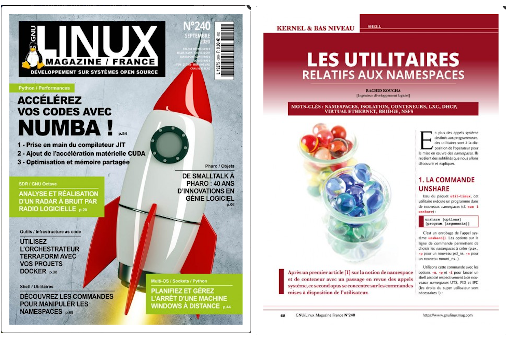
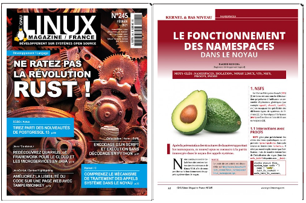
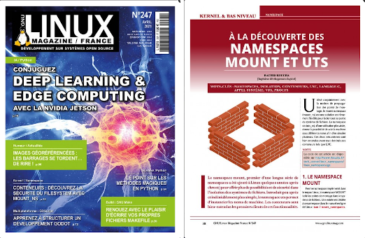

# Example programs to study linux namespaces

[1 Introduction](#1_Introduction)  
[2 Maintainers](#2_Maintainers)  
[3 Download ](#3_Download)  
[4 Build ](#4_Build)  
[5 Covers ](#5_Covers)  
[6 Description of the utilities](#6_Utils)  
&nbsp;&nbsp;&nbsp;&nbsp;[6.1 lxc-pid](#6_1_lxc_pid)  
&nbsp;&nbsp;&nbsp;&nbsp;[6.2 lxc-start2](#6_2_lxc_start2)  
&nbsp;&nbsp;&nbsp;&nbsp;[6.3 cmpns](#6_3_cmpns)  
&nbsp;&nbsp;&nbsp;&nbsp;[6.4 clonens](#6_4_clonens)  
&nbsp;&nbsp;&nbsp;&nbsp;[6.5 execns](#6_5_execns)  
&nbsp;&nbsp;&nbsp;&nbsp;[6.6 shns](#6_6_shns)  
&nbsp;&nbsp;&nbsp;&nbsp;[6.7 idns](#6_7_idns)  
&nbsp;&nbsp;&nbsp;&nbsp;[6.8 ownerns](#6_8_ownerns)  
&nbsp;&nbsp;&nbsp;&nbsp;[6.9 parentns](#6_9_parentns)  
&nbsp;&nbsp;&nbsp;&nbsp;[6.10 userns](#6_10_userns)  
&nbsp;&nbsp;&nbsp;&nbsp;[6.11 linfo](#6_11_linfo)  
&nbsp;&nbsp;&nbsp;&nbsp;[6.12 setnshost](#6_12_setnshost)  

## <a name="1_Introduction"></a>1 Introduction

The examples programs available here illustrate the articles serie **published in french** for [GNU Linux Magazine France](https://boutique.ed-diamond.com/) presenting the Linux namespaces in details from user to kernel space. They are written with a minimum number of lines to make them easier to understand. Hence, the code may appear not robust (no checks on the return codes, basic algorithmic...).

The articles are first published in the magazine. The list is located [here](https://connect.ed-diamond.com/auteur/Koucha-Rachid). They become available for free after 5 to 6 months (a **pdf** copy is in the _articles_ sub-directory).  At the moment, the articles available for free are:

- [Les namespaces ou l'art de se d&eacute;multiplier](https://connect.ed-diamond.com/GNU-Linux-Magazine/GLMF-239/Les-namespaces-ou-l-art-de-se-demultiplier).

## <a name="2_Maintainers"></a>2 Maintainers

For any question, please contact [Rachid Koucha](mailto:rachid.koucha@gmail.com)

## <a name="3_Download"></a>3 Download

The source code is available on github. Use the following command to clone it:
```
$ git clone https://github.com/Rachid-Koucha/linux_ns.git
```
The example programs are at the top level. The articles available for free are in the _articles_ sub-directory in **pdf** format.

## <a name="4_Build"></a>4 Build

The build is done with cmake:
```
$ cmake .
-- The C compiler identification is GNU 9.3.0
-- Check for working C compiler: /usr/bin/cc
-- Check for working C compiler: /usr/bin/cc -- works
[...]
$ make
Scanning dependencies of target reaper
[  1%] Building C object CMakeFiles/reaper.dir/reaper.c.o
[  2%] Linking C executable reaper
[  2%] Built target reaper
[...]
```

To clean the built files:
```
$ make clean
```

## <a name="5_Covers"></a>5 Covers

The covers of the published articles are:

<p align="left"><a href="articles/linux_namespaces_01.pdf"></a></p>

<p align="left"></p>

<p align="left"></p>

<p align="left"></p>

<p align="left"></p>

<p align="left"></p>

## <a name="6_Utils"></a>6 Description of the utilities

The following simple utilities are used to illustrate the articles serie concerning the Linux namespaces. They are not designed to be used in a larger scope although they may provide some hints to write some more elaborated tools around the Linux namespaces.

### <a name="6_1_lxc_pid"></a>6.1 lxc-pid

`lxc-pid` is a shell script which retrieves and displays the pid of the _init_ process of a LXC container.

For example:
```none
$ sudo lxc-start -n bbox
$ sudo lxc-ls -f
$ sudo lxc-ls -f
NAME    STATE   AUTOSTART GROUPS IPV4       IPV6 UNPRIVILEGED 
bbox    RUNNING 0         -      10.0.3.230 -    false     
$ sudo ./lxc-pid bbox
14642
$ sudo lxc-stop -n bbox
$ $ sudo ./lxc-pid bbox
Unknown container bbox
```
### <a name="6_2_lxc_start2"></a>6.2 lxc-start2

`lxc-start2` is a shell script to start a LXC container which displays its name in its shell prompt.

For example, we start a container named _bbox_ (of course it is supposed to have been created):
```none
$ sudo ./lxc-start2 bbox
$ sudo lxc-attach -n bbox
$ sudo lxc-console -n bbox -t 0

Connected to tty 0
Type <Ctrl+a q> to exit the console, <Ctrl+a Ctrl+a> to enter Ctrl+a itself

BusyBox v1.30.1 (Ubuntu 1:1.30.1-4ubuntu4) built-in shell (ash)
Enter 'help' for a list of built-in commands.

bbox# <CTRL>+<a>+<q>
$
```

### <a name="6_3_cmpns"></a>6.3 cmpns

`cmpns` compares the namespaces of two processes which identifiers are passed as parameters.

In this example, we compare the namespaces of the current shell with the namespaces of the _init_ process of the host:
```none
$ sudo ./cmpns $$ 1
cgroup is equal
ipc is equal
mnt is equal
net is equal
pid is equal
user is equal
uts is equal
```

In this example, we compare the namespaces of the current shell with the namespaces of the _init_ process of a LXC container:
```none
$ sudo lxc-start -n bbox
$ sudo ./lxc-pid bbox
14857
$ sudo ./cmpns $$ 14857
cgroup is different
ipc is different
mnt is different
net is different
pid is different
user is equal
uts is different
```
Privileged containers run in the same user namespaces as the host. Hence, the equality in the above display.

### <a name="6_4_clonens"></a>6.4 clonens

`clonens` creates a new process in new namespaces. The latters are passed as
parameters with their symbolic names (_cgroup_, _ipc_, _mnt_, _net_, _pid_, _user_ and _uts_).

For example, in one terminal, we launch a process in new pid and uts namespaces. The launched process is suspended on `pause()`:
```none
$ sudo ./clonens pid uts
Created process 14950 in requested namespaces
```
In another terminal, we compare the namespaces of the new process with the namespaces of the
current shell to verify that the _uts_ and _pid_ namespaces are different:
```none
$ sudo ./cmpns 14950 $$
cgroup is equal
ipc is equal
mnt is equal
net is equal
pid is different
user is equal
uts is different
```
### <a name="6_5_execns"></a>6.5 execns

`execns` executes a program in one or more namespaces of a running process.

In this example, we run a shell in the namespaces of the _init_ process of a running LXC container:
```none
$ sudo ./lxc-pid bbox
14857
$ PS1="\h#\x20" sudo -E ./execns 14857 /bin/sh
Moved into namespace ipc
Moved into namespace pid
Moved into namespace net
Moved into namespace uts
Moved into namespace cgroup
Moved into namespace mnt


BusyBox v1.30.1 (Ubuntu 1:1.30.1-4ubuntu4) built-in shell (ash)
Enter 'help' for a list of built-in commands.

bbox# exit
program's status: 0 (0x0)
```
### <a name="6_6_shns"></a>6.6 shns

`shns` creates shell in the namespaces specified as parameters.

For example:
```none
$ PS1="SHNS# " sudo -E ./shns
New namespace 'ipc'
New namespace 'pid'
New namespace 'net'
New namespace 'user'
New namespace 'uts'
New namespace 'cgroup'
New namespace 'mnt'
SHNS# date
dim. 28 mars 2021 18:57:37 CEST
SHNS# exit
/bin/sh: 5: Cannot set tty process group (No such process)
program's status: 0 (0x0)
```
### <a name="6_7_idns"></a>6.7 idns

`idns` displays the identifiers of one or more namespaces of a given process. By default, all
the namespaces are considered.

For example, to display the identifiers of the namespaces of the current shell:
```none
$ sudo ./idns $$
/proc/7622/ns/cgroup [Device,Inode]: [4,4026531835]
/proc/7622/ns/ipc [Device,Inode]: [4,4026531839]
/proc/7622/ns/mnt [Device,Inode]: [4,4026531840]
/proc/7622/ns/net [Device,Inode]: [4,4026531992]
/proc/7622/ns/pid [Device,Inode]: [4,4026531836]
/proc/7622/ns/uts [Device,Inode]: [4,4026531838]
/proc/7622/ns/user [Device,Inode]: [4,4026531837]
$ sudo ./idns $$ uts ipc
/proc/7622/ns/uts [Device,Inode]: [4,4026531838]
/proc/7622/ns/ipc [Device,Inode]: [4,4026531839]
```
### <a name="6_8_ownerns"></a>6.8 ownerns

`ownerns` displays the user_ns owning a the namespaces of a given process.

For example, we display the user_ns owning the namespaces of the current shell:
```none
$ sudo ./ownerns $$
/proc/7622/ns/cgroup belongs to [Device,Inode]: [4,4026531837]
/proc/7622/ns/ipc belongs to [Device,Inode]: [4,4026531837]
/proc/7622/ns/mnt belongs to [Device,Inode]: [4,4026531837]
/proc/7622/ns/net belongs to [Device,Inode]: [4,4026531837]
/proc/7622/ns/pid belongs to [Device,Inode]: [4,4026531837]
/proc/7622/ns/uts belongs to [Device,Inode]: [4,4026531837]
ERROR@main#87: ioctl(/proc/7622/ns/user, NS_GET_USERNS): 'Operation not permitted' (1)
```

### <a name="6_9_parentns"></a>6.9 parentns

`parentns` displays the parent namespace of a the namespaces of a given process. This works only for
hierarchical namespaces (i.e. _pid_ns_ and _user_ns_).

For example, we display the parent user_ns of the _init_ process of a running LXC container:
```none
$ sudo ./lxc-pid bbox
14857
$ sudo ./parentns 14857 pid user
/proc/14857/ns/pid is child of [Device,Inode]: [4,4026531836]
ERROR@main#89: ioctl(/proc/14857/ns/user, NS_GET_PARENT): 'Operation not permitted' (1)
```
In the above display, there is an error for the user_ns as a privileged container runs in the user_ns as the host. And it is not possible to get the parent user namespace of the initial user_ns.

### <a name="6_10_userns"></a>6.10 userns

`userns` displays the name and the user identifier of the user which created the user namespaces of a given process.

For example, we display the user identifier of the creator of the user namespace of the current shell:
```none
$ echo $$
7622
$ sudo ./userns $$
/proc/7622/ns/user belongs to user: 'root' (0)
```
### <a name="6_11_linfo"></a>6.11 linfo

`linfo` displays information about a symbolink link.

For example:
```none
$ ./linfo /proc/$$/ns/mnt
Symbolic link:
	Name: /proc/3098/ns/mnt
	Rights: 0777
	Device (major/minor): 0x0/0x5
	Inode: 0x1a284 (107140)
Target:
	Name: mnt:[4026531840]
	Rights: 0444
	Device (major/minor): 0x0/0x4
	Inode: 0xf0000000 (4026531840)
```


### <a name="6_12_setnshost"></a>6.12 setnshost

`setnshost` sets the hostname in the uts namespace of a given process

For example, we set the hostname in a LXC container using the pid of its _init_ process:
```none
$ sudo lxc-start -n bbox
$ sudo lxc-console -n bbox -t 0
Connected to tty 0
Type <Ctrl+a q> to exit the console, <Ctrl+a Ctrl+a> to enter Ctrl+a itself

BusyBox v1.30.1 (Ubuntu 1:1.30.1-4ubuntu4) built-in shell (ash)
Enter 'help' for a list of built-in commands.

/ # hostname
bbox
/ # <CTRL>+<a>+<q>
$ sudo ./lxc-pid bbox
5865
$ sudo ./setnshost 5865 qwerty
$ sudo lxc-console -n bbox -t 0

Connected to tty 0
Type <Ctrl+a q> to exit the console, <Ctrl+a Ctrl+a> to enter Ctrl+a itself

/ # hostname
qwerty
/ # <CTRL>+<a>+<q>
$
```


