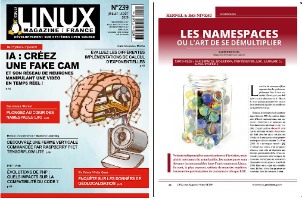
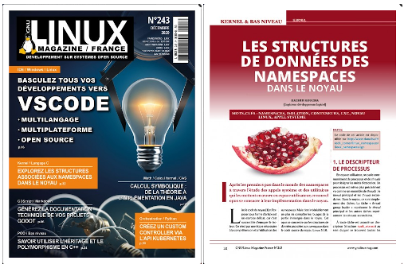

# Example programs to study linux namespaces

[1 Introduction](#1_Introduction)  
[2 Maintainers](#2_Maintainers)  
[3 Download ](#3_Download)  
[4 Build ](#4_Build)  
[5 Covers ](#5_Covers)  

## <a name="1_Introduction"></a>1 Introduction

The examples programs available here illustrate the articles serie **published in french** for [GNU Linux Magazine France](https://boutique.ed-diamond.com/) presenting the Linux namespaces in details from user to kernel space. They are written with a minimum number of lines to make them easier to understand. Hence, the code may appear not robust (no checks on the return codes, basic algorithmic...).

The articles are first published in the magazine. The list is located [here](https://connect.ed-diamond.com/auteur/Koucha-Rachid). They become available for free after 5 to 6 months (a **pdf** copy is in the _articles_ sub-directory).  At the moment, the articles available for free are:

- [Les namespaces ou l'art de se d&eacute;multiplier](https://connect.ed-diamond.com/GNU-Linux-Magazine/GLMF-239/Les-namespaces-ou-l-art-de-se-demultiplier).

## <a name="2_Maintainers"></a>2 Maintainers

For any question, please contact [Rachid Koucha](mailto:rachid.koucha@gmail.com)

## <a name="3_Download"></a>3 Download

The source code is available on github. Use the following command to clone it:
```
$ git clone https://github.com/Rachid-Koucha/linux_ns.git
```
The example programs are at the top level. The articles available for free are in the _articles_ sub-directory in **pdf** format.

## <a name="4_Build"></a>4 Build

The build is done with cmake:
```
$ cmake .
-- The C compiler identification is GNU 9.3.0
-- Check for working C compiler: /usr/bin/cc
-- Check for working C compiler: /usr/bin/cc -- works
[...]
$ make
Scanning dependencies of target reaper
[  1%] Building C object CMakeFiles/reaper.dir/reaper.c.o
[  2%] Linking C executable reaper
[  2%] Built target reaper
[...]
```

To clean the built files:
```
$ make clean
```

## <a name="5_Covers"></a>5 Covers

The covers of the published articles are:

<p align="left"><a href="articles/linux_namespaces_01.pdf"></a></p>

<p align="left"></p>

<p align="left"></p>

<p align="left"></p>

<p align="left"></p>

<p align="left"></p>

